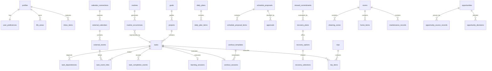

# Data Model

## 1. Modeling principles

1. PostgreSQL owns durable application state.
2. Google Calendar events are mirrored external records, not converted into internal tasks automatically.
3. Tasks are the common unit of executable work; specialized modules link to tasks rather than rebuilding scheduling fields.
4. Derived recommendations are stored as versioned snapshots so explanations and decisions remain auditable.
5. External content carries provenance and verification state.
6. Every user-owned row has `user_id` and RLS.
7. Soft deletion is used for normal entities; audit, approval, decision, and job history is append-oriented.
8. Money is stored as integer cents with ISO currency code.
9. Timestamps are `timestamptz` in UTC. Local dates and source timezones are separately preserved where calendar semantics require them.

## 2. Core entities

### Identity

- `profiles`: display name, home timezone, locale, onboarding state.
- `user_preferences`: planning horizon, buffers, quiet hours, capacity reserve, notification caps, starter-data state.

### Registry

- `life_areas`: Work, Home, Fitness, Learning, Travel, Finance/Admin, Business, Recovery, and user-defined areas.
- `inbox_items`: raw capture plus suggested type, confidence, duplicate status, conversion target.
- `goals`: desired outcomes and target dates.
- `projects`: multi-step outcomes linked to goals.
- `tasks`: executable work and scheduling metadata.
- `task_dependencies`: directed dependency edges.
- `routines`: recurrence policy and recovery window.
- `routine_occurrences`: generated or observed instances linked to tasks.
- `task_completion_events`: full, minimum viable, partial, canceled, delegated, or skipped completion facts.

### Capacity and planning

- `availability_rules`: recurring user availability and protected rest.
- `energy_checkins`: timestamped energy state and reason.
- `capacity_profiles`: user defaults and learned suggestions.
- `daily_plans`: one versioned plan per local date and generation run.
- `daily_plan_items`: event/task/open-buffer items with planned intervals.
- `priority_snapshots`: score components, confidence, rank, explanation, engine version.
- `schedule_proposals`: proposed internal or external schedule mutations.
- `schedule_proposal_items`: exact before/after operations and displaced work.
- `approvals`: immutable approve/reject/expire records.

### Calendar

- `calendar_connections`: provider account, scopes, encrypted tokens, status.
- `external_calendars`: selected calendar metadata.
- `calendar_sync_states`: cursor, status, leases, and last success.
- `external_events`: provider event mirror with recurrence and deletion state.
- `task_event_links`: relationship between internal task and external event.
- `calendar_watch_channels`: Phase 2 Google push channel lifecycle.

### Recovery

- `missed_commitments`: detected miss, root cause, evidence, and impact.
- `recovery_plans`: engine input snapshot and overall result.
- `recovery_options`: ranked alternatives and feasibility.
- `recovery_selections`: chosen option and resulting state changes.

### Home

- `rooms`: room registry.
- `home_items`: furnishing, supply, appliance, or owned-item registry.
- `cleaning_zones`: recurring definitions of done.
- `maintenance_records`: concern, history, next inspection, landlord request status.
- `room_use_options`: evaluated second-bedroom or other room configurations.

### Fitness

- `fitness_profiles`: weekly frequency and scheduling preferences.
- `workout_templates`: gym/home/minimum templates with equipment and duration.
- `workout_sessions`: specialized session state linked to a task.

### Learning

- `learning_sessions`: objective, source, practice, evidence, next action, review date, linked task.

### Travel

- `trips`: dates, timezone, budget, readiness, and verification state.
- `trip_items`: booking, packing, outfit, purchase, document, event, return-reset, or task links.

### Opportunities

- `opportunity_sources`: provider policy, authorization, terms review, and status.
- `opportunities`: normalized facts, provenance, verification, fit, deadline, cost, value, recommendation.
- `opportunity_source_records`: original provider identifiers and hashes.
- `opportunity_decisions`: pursue, review, watch, dismiss, follow-up.

### Notifications and review

- `notification_preferences`: channel and category rules.
- `notifications`: actionable notification record and dedupe key.
- `notification_deliveries`: channel attempts and provider status.
- `weekly_reviews`: generated draft and user-approved review.

### Accountability and operations

- `decisions`: context, alternatives, reason, expected and actual outcomes.
- `audit_events`: immutable security and mutation facts.
- `mutation_history`: reversible internal mutation snapshots.
- `job_runs`: durable background-job ledger.
- `rolling_state_snapshots`: compact exportable operational state.

## 3. Relationship map



## 4. State machines

### Task status

```text
inbox -> ready -> planned -> in_progress -> completed
                  |             |            |
                  v             v            v
                blocked       missed       archived
                  |             |
                  +-----> ready/replanned

ready/planned/in_progress -> canceled
```

`missed` is not terminal. A recovery selection moves the task to planned, ready, completed-minimum, or intentionally skipped through a completion event.

### Project status

`proposed -> active -> paused -> completed`, with `canceled` and `archived`. Active without next action yields computed health `stalled` but does not force a status change.

### Schedule proposal

`draft -> ready_for_approval -> approved -> executing -> executed`

Alternative exits: `rejected`, `expired`, `stale`, `failed`, `canceled`.

### Calendar connection

`pending -> connected -> degraded -> reconnect_required -> disconnected`

Token revocation, invalid grant, or repeated unauthorized response moves to `reconnect_required`.

### Opportunity

`new -> verified -> reviewed -> watch/pursue/dismiss -> expired`

Unverified records remain `new` or `needs_verification` and cannot trigger critical notification.

## 5. Source and confidence

All user-facing facts that may be inferred or imported include:

- `source_type`: user, calendar, starter, provider, derived.
- `source_ref`: non-secret provider or record identifier.
- `confidence`: 0 to 1 for inferred values.
- `verification_status`: unverified, user_confirmed, provider_confirmed, conflicting, expired.

User confirmation overrides an inference but not a newer provider fact without conflict disclosure.

## 6. Time model

- `starts_at` and `ends_at`: UTC instants for timed events.
- `event_timezone`: IANA timezone supplied by provider or user.
- `local_date`: date used for daily planning in the user’s home timezone.
- All-day Google events store `start_date` and exclusive `end_date`, not fake midnight instants.
- Recurrence master and instance identifiers are preserved.
- Daylight-saving transitions are tested using IANA timezone rules, never manual offsets.

## 7. Money model

- `cost_cents`, `budget_cents`, `expected_value_cents` are signed 64-bit integers where applicable.
- `currency_code` defaults to `USD` but is stored per record.
- Unknown cost is `NULL`, never zero.
- Financial compatibility is derived from user-entered budget envelopes; Phase 1 does not read bank balances.

## 8. Deletion and retention

- User entities use `deleted_at` for normal soft deletion.
- External event mirrors are marked provider-deleted before retention purge.
- OAuth tokens are deleted immediately on disconnect after revocation attempt.
- Audit events retain minimal security metadata according to published policy and do not retain deleted content bodies.
- Exports are generated on demand, time-limited, and excluded from normal analytics.

## 9. Derived read models

The Command Center should use server-side query functions or views that return:

- today events
- committed tasks
- open windows
- top three priorities
- at-risk items
- active recovery proposals
- pending approvals
- domain readiness summaries
- sync health

Views must use `security_invoker` or equivalent safe access and remain protected by RLS.

## 10. Data integrity rules

- A task end or due date cannot precede its start/preferred date where both exist.
- Duration must be positive and bounded.
- Dependency self-links and duplicate edges are prohibited.
- An external event is unique by user, connection, calendar, provider event ID, and recurrence instance key.
- Only one active sync lease exists per calendar.
- Only one selected recovery option exists per recovery plan.
- One idempotency key may create only one mutation result per user and operation.
- Approval actor must own the proposal.
- Starter-data rows are labeled and removable without touching user-created rows.
