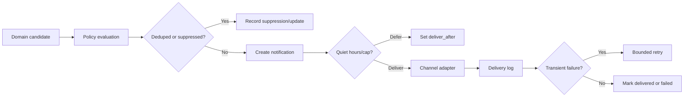

# Notification System

## 1. Objective

Notifications should cause a useful decision or action. They must not turn every task into an alarm or use anxiety as a retention strategy.

## 2. Phase scope

### Phase 1

- In-app pending approval count
- Calendar connection and sync failure alerts
- Recovery options visible in Command Center
- Notification preference storage
- Delivery history schema

### Phase 2

- Browser notifications where supported
- Installable PWA push architecture after permission
- Optional email adapter
- Background evaluation
- Weekly digest
- Snooze, acknowledgment, delivery retries, and provider monitoring

No mobile-native push is claimed unless a native wrapper and platform credentials are actually implemented.

## 3. Notification event model

A domain event is not automatically a user notification. Domain services emit candidate events such as:

- `approval.required`
- `calendar.sync_failed`
- `calendar.reconnect_required`
- `task.at_risk`
- `recovery.options_ready`
- `travel.deadline_risk`
- `maintenance.follow_up_due`
- `weekly_review.ready`
- `opportunity.critical_verified`
- `system.job_dead_letter`

The notification policy engine decides channel, urgency, timing, grouping, dedupe, and suppression.

## 4. Urgency

### Critical

Verified, time-sensitive, material consequence, and user action is still possible. Examples: Calendar authorization broke before planning; verified trip document deadline today; approved write failed and caused schedule divergence.

### High

Important and actionable soon, but not emergency. Examples: pending approval blocks tomorrow’s plan; a protected workout recovery window is closing.

### Normal

Useful routine reminder or digest item.

### Low

Status update or watchlist change; usually in-app or digest only.

Opportunity content cannot be Critical unless source-confirmed and deadline-verified.

## 5. Preferences

Per category and channel:

- enabled/disabled
- minimum urgency
- immediate, daily digest, weekly digest, or silenced
- quiet-hour override
- maximum repeats
- preferred local delivery window

Global:

- quiet hours
- daily cross-channel cap
- weekend behavior
- vacation mode
- browser permission state
- email verified state

Critical does not automatically bypass quiet hours. Only categories explicitly allowed by the user may override them.

## 6. Deduplication and grouping

Dedupe key examples:

```text
approval:<proposal_id>:<proposal_version>
calendar-sync:<calendar_id>:<error_class>:<date_bucket>
recovery:<missed_commitment_id>:<plan_version>
trip-risk:<trip_id>:<item_id>:<risk_state>
opportunity:<opportunity_id>:<material_revision>
```

Rules:

- Same dedupe key updates the existing notification rather than creating another.
- Multiple low/normal items in one category are grouped into a digest.
- A materially changed risk may create a new revision.
- Acknowledged items do not repeat unless state worsens or user-configured repeat policy permits it.
- Dismissed opportunities do not notify again without material source change.

## 7. Rate limits

Default caps:

- 6 total non-critical notifications per day
- 2 high-urgency interruptions per 4-hour window
- 1 repeated alert per unresolved object per day
- Weekly digest contains a configurable maximum, default 12 items

Critical alerts are still deduplicated and capped by object. A provider outage affecting many records becomes one system alert.

## 8. Quiet hours and timing

All scheduling uses the user’s home timezone unless a travel mode is explicitly active.

During quiet hours:

- In-app records may be created silently.
- Browser/email delivery is deferred.
- Allowed critical categories may deliver once.
- Deferred items are reevaluated at quiet-hour end; expired or irrelevant items are suppressed.

DST transitions use IANA timezone calculations.

## 9. Snooze and acknowledgment

Snooze requires a future time or preset. On wake:

- Reevaluate whether the underlying condition still exists.
- Do not redeliver if resolved.
- Update dedupe state instead of cloning.

Acknowledgment records that the user saw the notification. It does not automatically complete the underlying task or approve a proposal.

## 10. Approval notifications

Approval notification contains:

- What will change
- Affected date/time and timezone
- Reason
- Conflict or displacement count
- Expiration
- Link to full diff

The notification itself may deep-link to approval but cannot approve from an unauthenticated email link or browser action.

## 11. Delivery pipeline



## 12. Browser notifications

- Ask permission only after the user enables the feature and sees the benefit.
- Record denied, granted, or unsupported state.
- Service worker payload contains minimal IDs and safe text.
- Opening a notification requires authenticated app state.
- Sensitive calendar details and confirmation numbers are excluded from lock-screen text by default.

## 13. Email adapter

Recommended default is Resend if the owner selects it, but the provider is replaceable.

Requirements:

- Verified sending domain
- Unsubscribe/preferences link for non-operational messages
- Signed deep links with short expiration that still require authentication for material actions
- Bounce and complaint webhook handling
- No full calendar descriptions or sensitive trip details in email by default
- Provider delivery ID stored in `notification_deliveries`

Without credentials and verified domain, email remains disabled and labeled “requires credentials.”

## 14. Failure behavior

- Delivery failure does not mark notification delivered.
- Repeated provider failure creates one in-app system alert.
- Missing browser permission is not an error.
- If the app is offline, in-app state appears after reconnect; no claim of real-time delivery is made.
- Job dead letters require a visible system-status item.

## 15. Acceptance criteria

- Duplicate candidate events create one actionable notification.
- Quiet hours defer non-authorized notifications.
- Snoozed items are reevaluated before redelivery.
- Daily caps group overflow instead of dropping critical state silently.
- Delivery history distinguishes queued, sent, delivered when provider supports it, failed, and suppressed.
- No notification directly performs a destructive or external action.
