# Opportunity Radar

## 1. Phase rule

Opportunity Radar is Phase 3. It must not delay or contaminate the Phase 1 daily core. No ingestion route, provider credential, or “live opportunity” badge may be enabled until Phase 1 is operational and Phase 2 job, notification, provenance, and security controls are proven.

## 2. Supported categories

- Affordable vacation deals
- Grants and business grants
- Professional development
- Contracts and gigs
- Local events and networking
- Educational opportunities
- Useful AI tools
- Home and furnishing deals
- User-defined categories

## 3. Source policy

Preferred source order:

1. Official government or provider API
2. Authorized partner API
3. Official RSS/Atom or documented feed
4. User-provided source or subscription
5. Approved search provider returning source links
6. Documented manual-review workflow

Broad scraping is not approved by default. Each source requires a record of terms review, robots/access constraints where relevant, authentication method, rate limits, allowed retention, attribution, and deletion requirements.

## 4. Provider adapter contract

```typescript
interface OpportunityProvider {
  id: string;
  category: OpportunityCategory;
  capabilities: {
    search: boolean;
    incrementalCursor: boolean;
    fullDetails: boolean;
  };
  fetch(request: ProviderRequest): Promise<ProviderBatch>;
  normalize(record: unknown): NormalizedOpportunityCandidate;
  verify(candidate: NormalizedOpportunityCandidate): VerificationResult;
}
```

Adapters return data; they cannot create tasks, send notifications, write calendars, submit forms, or make purchases.

## 5. Ingestion pipeline

```mermaid
flowchart LR
  A[Authorized source] --> B[Fetch with rate limit]
  B --> C[Store provenance and content hash]
  C --> D[Normalize typed fields]
  D --> E[Sanitize untrusted content]
  E --> F[Duplicate clustering]
  F --> G[Verification checks]
  G --> H[Fit and compatibility scoring]
  H --> I[Notification tier decision]
  I --> J[User review]
```



## 6. Required opportunity fields

- Source and source URL/reference
- Provider record ID
- Retrieval timestamp
- Content hash
- Category
- Title and concise summary
- Verification status
- Eligibility requirements and evidence
- Deadline and timezone
- Estimated cost and currency
- Expected value type and estimate
- Effort estimate
- Calendar compatibility
- Financial compatibility
- Geographic compatibility
- Confidence
- Duplicate cluster ID
- Expiration date
- Recommendation: pursue, review, watch, dismiss
- Reasoning
- User decision
- Follow-up date

Unknown values remain null. Zero is not used for unknown cost.

## 7. Verification states

- `unverified`: normalized but not checked
- `source_confirmed`: facts present on authoritative source
- `eligibility_unclear`: source exists but user fit cannot be established
- `conflicting`: sources disagree
- `expired`: deadline passed or source removed
- `invalid`: scam, broken source, or disallowed content

Critical alerts require `source_confirmed`, a verified deadline, and strong user fit.

## 8. Duplicate detection

Use layered matching:

1. Exact provider ID within source
2. Canonical URL and content hash
3. Normalized title, sponsor, location, and deadline
4. Similarity model only as a candidate generator
5. Human review for uncertain merges

A duplicate cluster preserves all provenance. Conflicting deadlines are surfaced, not overwritten.

## 9. Fit scoring

Opportunity fit is separate from daily task priority.

Default dimensions:

- Eligibility confidence: 25
- Strategic relevance: 20
- Expected value: 15
- Deadline feasibility: 10
- Effort reasonableness: 10
- Calendar compatibility: 8
- Financial compatibility: 8
- Source trust: 4

Unverified data caps total score at 45. A high expected value cannot overcome failed eligibility or unaffordable cost.

## 10. Financial guardrails

- No recommendation may assume available cash not entered by the user.
- Travel deals include total known cost, not headline fare only, when data permits.
- Grants distinguish award amount from likelihood and application cost.
- Paid tools must show recurring price and cancellation terms when verified.
- “Affordable” means compatible with a user-configured budget, not merely discounted.
- No automatic purchase, booking, application, or grant submission.

## 11. Prompt-injection and content security

Retrieved text is untrusted data. It cannot issue instructions to the application or model.

Controls:

- Strip scripts, active HTML, tracking parameters, and embedded forms.
- Store raw content in isolated restricted storage only if necessary.
- Pass only normalized fields to scoring.
- System prompts explicitly treat source text as quoted evidence, never instructions.
- Tool access for any model is allowlisted and read-only during analysis.
- Never expose tokens, internal prompts, user private state, or other opportunities to retrieved content.
- URLs are validated and opened with safe-link behavior.
- Attachments require malware and file-type checks before processing.

## 12. Notification tiers

- **Critical and time-sensitive:** verified deadline soon, high fit, action required; strict daily cap.
- **High-fit recommendation:** verified and valuable; batched when possible.
- **Weekly digest:** ordinary qualified opportunities.
- **Watchlist update:** material change to a watched item.
- **Silenced:** dismissed source/category or low confidence.

An ingestion failure never triggers “no opportunities exist.” It triggers a source-status warning.

## 13. Grants workflow

1. Retrieve from approved official sources.
2. Verify sponsor, program page, eligibility, deadline, and required geography/entity type.
3. Compare only user-confirmed eligibility facts.
4. Mark unknown requirements.
5. Create a review item, not an application.
6. With approval, create internal preparation tasks.
7. External submission remains prohibited.

## 14. Travel-deal workflow

1. Use authorized travel APIs or user-provided alerts.
2. Record exact search dates, travelers, baggage assumptions, lodging/transport exclusions, cancellation terms, and retrieval time.
3. Expire quickly because prices change.
4. Recheck before recommendation or booking discussion.
5. Never claim availability from stale data.

## 15. Rollout gates

- One source category at a time
- Contract tests for adapter
- Legal/terms review recorded
- Provenance visible in UI
- Deduplication test corpus passes
- Prompt-injection test corpus passes
- Notification caps pass simulation
- No direct write path to Calendar, purchases, messages, or submissions
