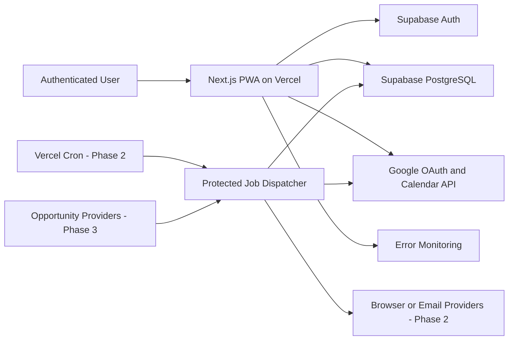
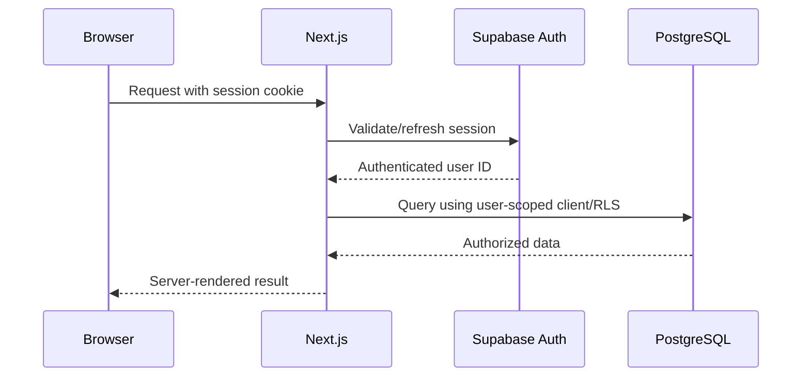
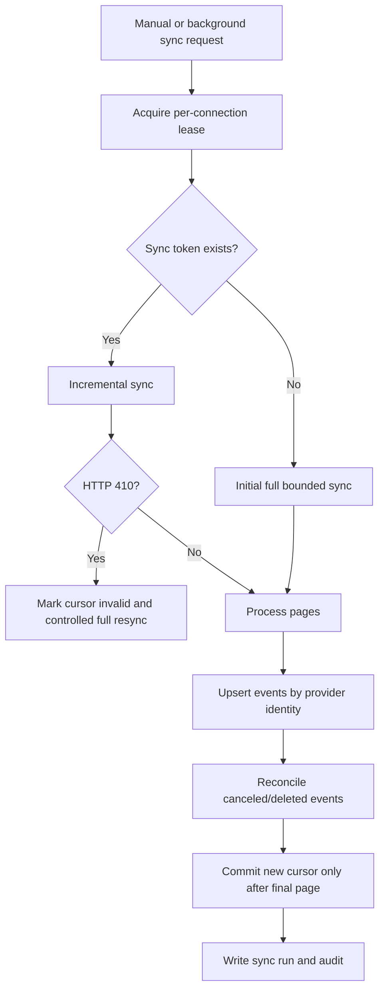

# System Architecture

## 1. Architectural objective

Build a production-grade, single-owner-first personal operations application with strong data ownership, explainable engines, real Google Calendar synchronization, approval-gated side effects, and a clean path to later background automation and verified opportunity ingestion.

The architecture favors a modular monolith over microservices. Splitting a personal application into many services would add failure modes, credentials, dashboards, and cost without creating user value.

## 2. Context diagram

## 3. Approved architecture style

### Modular monolith

One Next.js application contains UI, server routes, domain services, provider adapters, and job endpoints. PostgreSQL holds operational state. Domain boundaries are enforced in code and tests, not separate network services.

### Server-first rendering

- Server Components fetch authenticated read models.
- Client Components handle forms, local optimistic state, drag interactions, browser APIs, and offline capture.
- Mutations use route handlers or server actions that call the same domain service layer.
- Domain services never import React.

### Deterministic engines

Priority, capacity, scheduling feasibility, and recovery ranking are pure or side-effect-free modules that accept typed snapshots and return typed decisions. Persisted orchestration wraps them.

## 4. Technology stack

| Layer | Choice | Reason |
|---|---|---|
| Runtime | Node.js 24 LTS | Supported production LTS line |
| Web | Next.js 16.2 patched Active LTS | App Router, server rendering, route handlers, Vercel fit |
| UI | React 19.2, Tailwind, Radix primitives | Mature responsive composition and accessibility |
| Language | TypeScript strict | Domain safety and shared contracts |
| Database | Supabase PostgreSQL | Relational constraints, RLS, migrations, auth integration |
| Auth | Supabase Auth | Lower operational burden and RLS identity integration |
| Validation | Zod | Shared input and environment validation |
| Forms | React Hook Form plus Zod resolver | Mobile-friendly form state and field errors |
| Data fetching | Server reads; TanStack Query only for live client workflows | Avoid unnecessary client cache duplication |
| Jobs | Vercel Cron plus PostgreSQL job ledger, Phase 2 | Simple deployment with durable idempotency |
| Logging | Structured JSON, request and job correlation IDs | Searchable, privacy-controlled operations |
| Errors | Sentry-compatible adapter | Stack traces, releases, alerting; disabled until DSN exists |
| Unit tests | Vitest | Fast TypeScript domain tests |
| UI tests | Testing Library | Behavior-level component tests |
| E2E | Playwright | Real browser, mobile emulation, multi-browser |
| DB tests | pgTAP with Supabase CLI | Constraints and RLS validation |

## 5. Component boundaries

### Identity and account

Owns profiles, preferences, sessions, exports, deletion, and feature flags.

### Registry

Owns inbox, goals, projects, tasks, dependencies, routines, and completion events.

### Calendar

Owns OAuth connection metadata, encrypted tokens, selected calendars, synchronized events, sync cursors, task-event links, and provider errors.

### Planning

Owns availability, buffers, open-window calculation, daily plans, plan items, schedule proposals, approvals, and undoable internal changes.

### Priority

Owns scoring rules, snapshots, overrides, confidence, and explanations.

### Recovery

Owns missed-task detection, root-cause records, domain adapters, recovery plans, options, selections, and displaced-work analysis.

### Life-area modules

Home, Fitness, Learning, and Travel own their specialized metadata while linking execution work to ordinary tasks.

### Notifications

Owns notification events, preferences, delivery attempts, deduplication, snooze, acknowledgment, and quiet hours.

### Opportunities

Phase 3 adapter boundary for ingestion, normalization, provenance, verification, scoring, and decisions.

### Decisions and audit

Owns human-readable decisions, immutable audit events, engine versions, job records, and rolling state snapshots.

## 6. Data ownership

| Data | System of record | Notes |
|---|---|---|
| Task intent, definition of done, recovery policy | Mission Control DB | Never inferred from Calendar alone |
| Google event title/time/status | Google Calendar | Mirrored locally with provider revision fields |
| Internal schedule proposal | Mission Control DB | Not a Google event until executed |
| Approval | Mission Control DB | Immutable decision plus actor and timestamp |
| User timezone and buffers | Mission Control DB | Drives planning displays and defaults |
| Priority score | Derived snapshot in DB | Recomputable; store engine version and inputs |
| Opportunity facts | Original source plus normalized DB record | Provenance required |
| Notification delivery | Delivery provider plus DB attempt log | Provider response retained without message secrets |

## 7. Request lifecycle

Mutation lifecycle:

1. Validate session and CSRF posture.
2. Parse request with Zod.
3. Check idempotency key.
4. Start transaction or call a transactional database function.
5. Check current record version.
6. Apply domain rules.
7. Write entity changes, audit event, and inverse metadata where reversible.
8. Commit.
9. Revalidate affected routes or return updated read model.
10. Emit non-sensitive operational log.

## 8. Calendar sync architecture

A sync token is never advanced if any page fails. One connection has one active sync lease. Repeated webhook or cron events only enqueue or mark a sync-needed state; they do not run overlapping syncs.

## 9. Background jobs

Phase 2 adds a protected dispatcher endpoint invoked by Vercel Cron. The database is the durable job ledger.

`job_runs` fields include job type, subject, scheduled bucket, idempotency key, state, lease owner, lease expiry, attempts, next attempt, payload hash, result summary, and last error.

Rules:

- Unique constraint on `(job_type, idempotency_key)`.
- Worker acquires with `FOR UPDATE SKIP LOCKED` in a transaction.
- Lease expiry permits recovery after function termination.
- External side effect records provider idempotency metadata before marking success.
- Retry only classified transient failures.
- Permanent failures become visible system notifications.
- Cron secret and webhook channel tokens are validated.

## 10. PWA and poor connectivity

### Phase 1 supported offline behavior

- Installable web manifest.
- Cached app shell and last successful daily-state response.
- Read-only stale banner when offline.
- Rapid captures stored in IndexedDB with a client-generated UUID and idempotency key.
- Queue flush on reconnect; duplicate saves are suppressed server-side.

### Deferred offline behavior

- Editing arbitrary existing records offline.
- Calendar approval or external writes offline.
- Conflict-free multi-device merge.

The UI must never display queued offline capture as server-persisted until acknowledgment returns.

## 11. Observability

Every request, sync, job, proposal, approval, and external call receives a correlation ID. Logs include event name, user hash, record IDs, duration, status, retry count, and provider error class. Logs exclude titles, descriptions, notes, OAuth tokens, confirmation numbers, and raw opportunity content.

Required dashboards or queries:

- Authentication failures
- Calendar sync success rate and staleness
- Duplicate-event prevention conflicts
- Proposal approval and execution failure
- Job retry and dead-letter count
- Notification suppression and failure
- P95 route latency
- Database error rate
- Client crash rate by release

## 12. Failure isolation

- Command Center sections load independently enough that a Calendar failure does not block tasks.
- Opportunity ingestion cannot modify tasks or Calendar directly.
- A language-model adapter, if later enabled, cannot access OAuth tokens or execute writes.
- Notification failure does not roll back the underlying approved state change.
- Analytics failure never blocks product behavior.

## 13. Versioning

- Domain engine versions use semantic identifiers such as `priority-v1.0.0`.
- API routes are versioned under `/api/v1` when exposed to external clients; internal server actions still call domain services.
- Database migrations are timestamped and immutable after production deployment.
- Rolling state exports include schema version and generated timestamp.

## 14. Security architecture notes

Refresh tokens are encrypted before database storage using an application encryption key held only in server environment variables. Supabase Vault may be used for server-side database jobs, but browser-facing queries must never expose decrypted secret views. RLS is enabled even when most access passes through server routes.

## 15. Official implementation references

- Next.js App Router and installation documentation
- React 19.2 documentation
- Supabase RLS, secure data, Vault, migrations, and pgTAP testing documentation
- Google Calendar OAuth scopes, incremental sync, push notification, and quota documentation
- Vercel environment variable and Cron security documentation

The engineer must verify security advisories immediately before dependency installation. Use the latest patched stable release in the approved major/minor line, not a preview tag.
